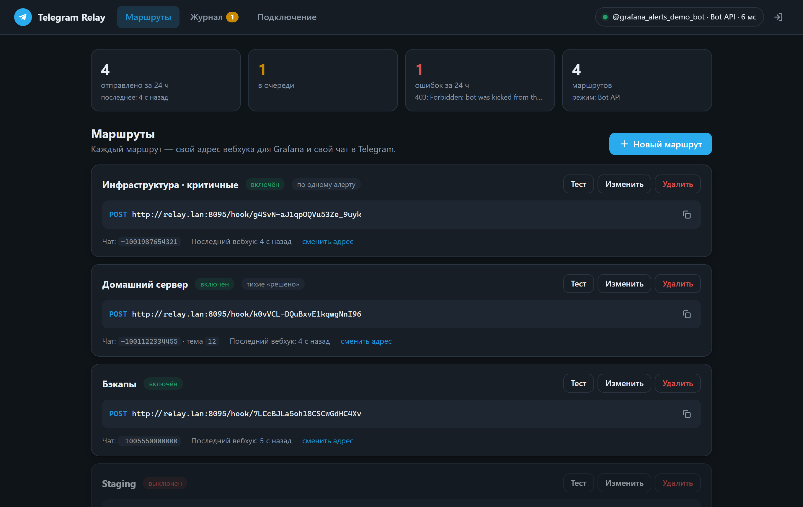
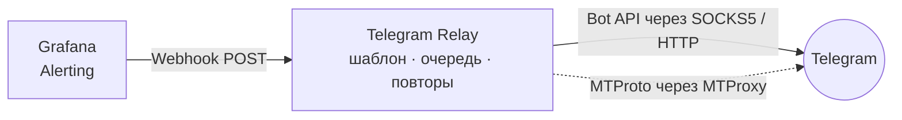
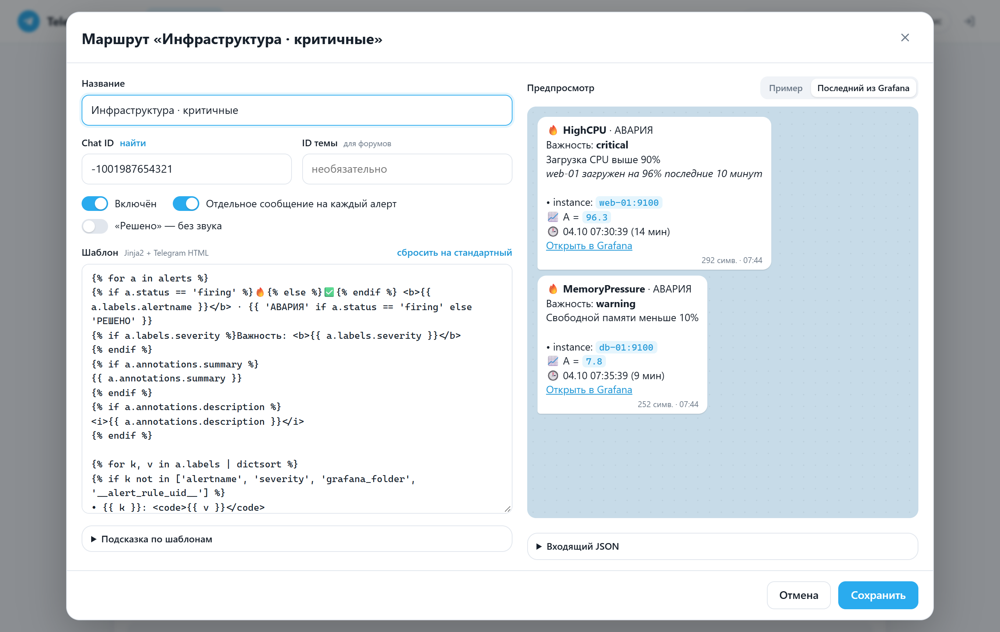
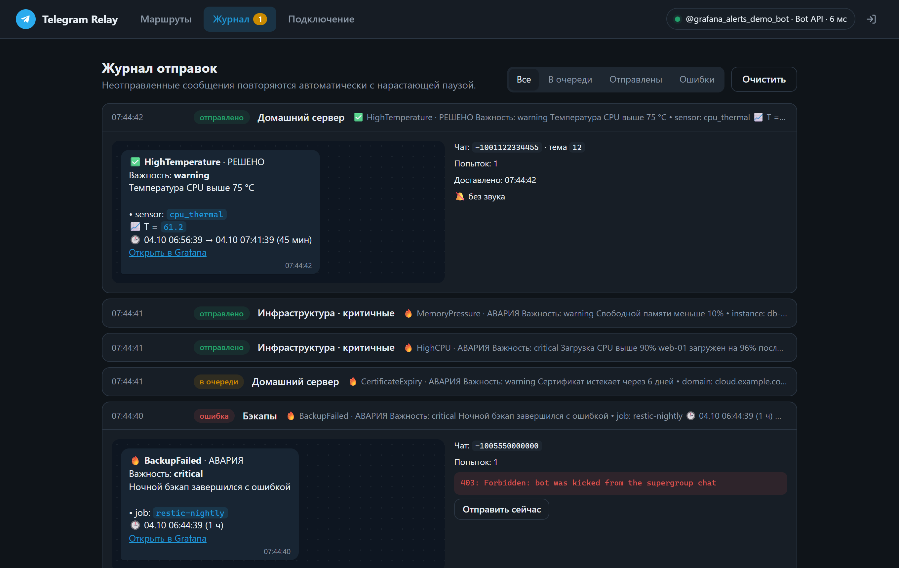
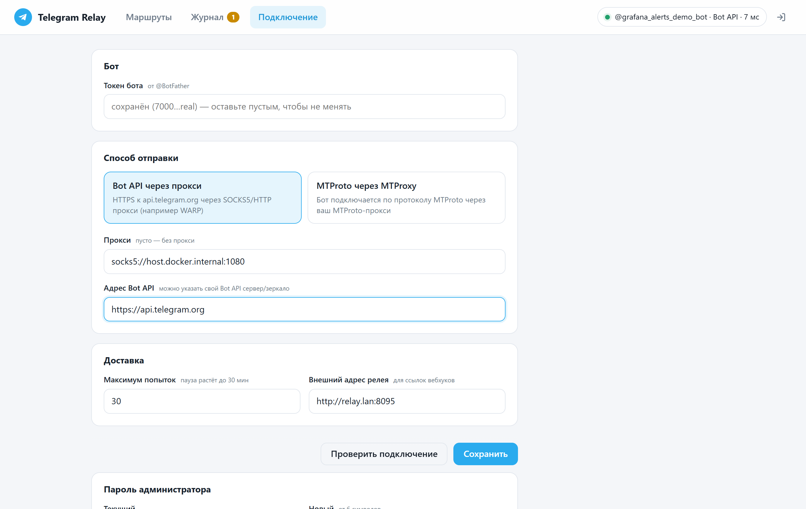
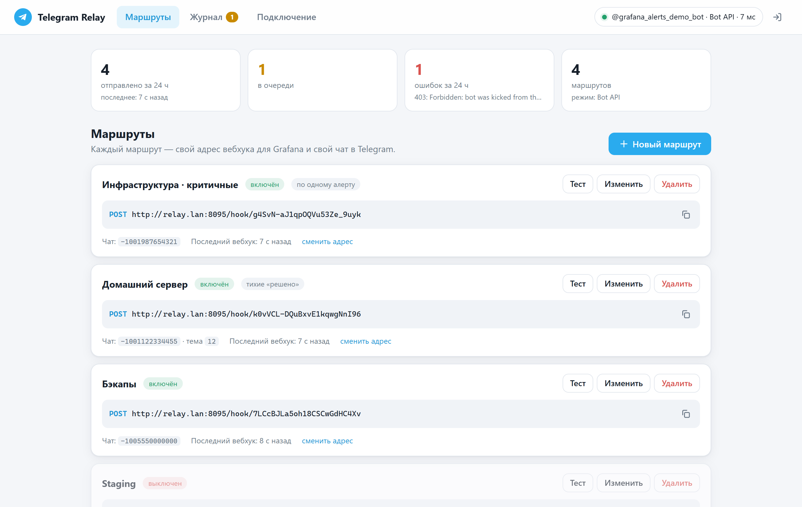
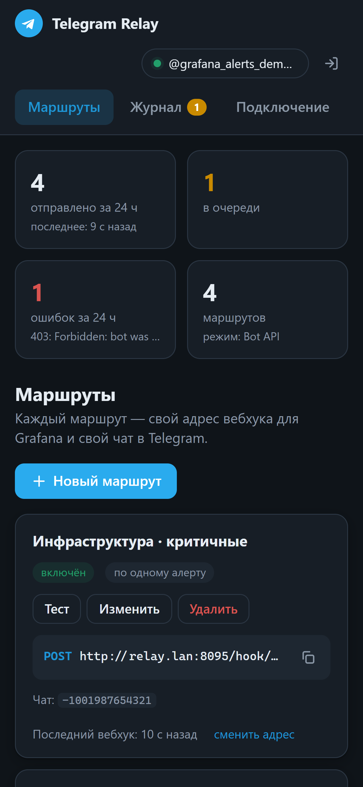
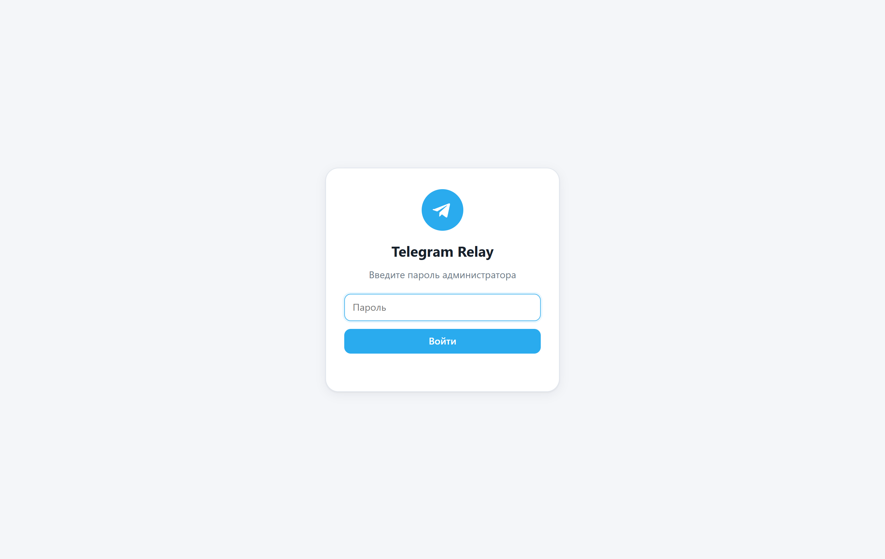

<div align="center">


# Grafana → Telegram Relay

**Доставляет алерты Grafana в Telegram там, где Telegram заблокирован.**<br>
Принимает вебхук, красиво оформляет сообщение и отправляет его через SOCKS5/HTTP‑прокси или MTProxy.<br>
Настраивается целиком из веб‑интерфейса.

[](https://github.com/AtomAlex12/grafana-telegram-relay/releases/latest)
[](https://github.com/AtomAlex12/grafana-telegram-relay/actions/workflows/ci.yml)


[](LICENSE)



</div>

## Зачем

В Grafana у контакт‑поинта Telegram нельзя указать прокси. Если `api.telegram.org` недоступен с сервера, алерты просто теряются.
Relay встаёт посередине: Grafana шлёт обычный **Webhook** в локальную сеть, а релей сам доставляет сообщение в Telegram — через прокси, с очередью и повторами.



## Установка одной командой

На любой машине с Docker (Linux x86‑64, Raspberry Pi и т.п.):

```bash
curl -fsSL https://github.com/AtomAlex12/grafana-telegram-relay/releases/latest/download/install.sh | bash
```

Откройте `http://<адрес-сервера>:8095`, задайте пароль администратора — и всё остальное настраивается в интерфейсе.

<details>
<summary>Параметры установщика</summary>

Переменные окружения перед `bash`:

```bash
curl -fsSL https://github.com/AtomAlex12/grafana-telegram-relay/releases/latest/download/install.sh \
  | TG_RELAY_PORT=9000 TG_RELAY_PROXY=socks5://host.docker.internal:1080 bash
```

| Переменная | По умолчанию | Описание |
|---|---|---|
| `TG_RELAY_DIR` | `/opt/tg-relay` (root) или `~/tg-relay` | Куда установить |
| `TG_RELAY_PORT` | `8095` | Порт веб‑интерфейса и вебхуков |
| `TG_RELAY_PROXY` | — | Прокси, который подставится при первом запуске |
| `TG_RELAY_REF` | версия релиза | Тег или ветка (`main` — свежая разработка) |

Повторный запуск той же команды **обновляет** релей — данные (`data/`) и `.env` сохраняются.

</details>

<details>
<summary>Вручную через Docker Compose</summary>

```bash
git clone https://github.com/AtomAlex12/grafana-telegram-relay.git
cd grafana-telegram-relay
cp .env.example .env      # порт, часовой пояс, прокси
docker compose up -d --build
```

</details>

## Возможности

- 🧭 **Маршруты** — у каждого свой секретный адрес вебхука, свой чат и тема форума.
- 🎨 **Шаблоны Jinja2 + Telegram HTML** с живым предпросмотром «как в Telegram» — на примере или на последнем реальном алерте из Grafana.
- 🔁 **Очередь с повторами** — если прокси или Telegram недоступны, сообщения ждут и уходят позже (пауза растёт 15 с → 30 мин). Вебхук всегда сразу отвечает `200`.
- 🛡️ **Два способа обхода блокировок** — Bot API через SOCKS5/HTTP прокси (например, Cloudflare WARP) или MTProto через MTProxy.
- ✂️ Один алерт = одно сообщение или всё одной пачкой; «решено» — без звука.
- 📜 **Журнал** доставки с причинами ошибок и кнопкой «отправить сейчас».
- 🔍 Поиск `chat_id` в один клик — бот сам покажет чаты, где его упоминали.
- 🔒 Вход по паролю, секреты маскируются, шаблоны выполняются в песочнице.
- 💾 Всё хранится в одном SQLite‑файле, никаких внешних зависимостей.

## Скриншоты

| Редактор шаблона с предпросмотром | Журнал доставки |
|---|---|
|  |  |
| **Подключение** | **Светлая тема** |
|  |  |

<p align="center">
  
  &nbsp;&nbsp;
  
</p>

## Настройка

### 1. Бот и способ отправки

Вкладка **«Подключение»**: вставьте токен от [@BotFather](https://t.me/BotFather) и выберите способ:

| Способ | Когда подходит | Что нужно |
|---|---|---|
| **Bot API через прокси** | есть SOCKS5/HTTP‑прокси, через который открывается `api.telegram.org` | URL прокси: `socks5://…`, `socks5h://…`, `http://…` |
| **MTProto через MTProxy** | есть только MTProto‑прокси | `api_id` и `api_hash` с [my.telegram.org](https://my.telegram.org), сервер/порт/секрет прокси |

> MTProto‑прокси не умеет проксировать Bot API (это обычный HTTPS), поэтому для него бот подключается по протоколу MTProto (через [Telethon](https://github.com/LonamiWebs/Telethon)).
> Ссылку `tg://proxy?server=…&port=…&secret=…` можно вставить в поле «Сервер» целиком. Fake‑TLS секреты (`ee…`) не поддерживаются — нужен `dd…` или обычный.

Прокси запущен на той же машине? Используйте адрес `host.docker.internal` — например, `socks5://host.docker.internal:1080`.

Кнопка **«Проверить подключение»** вызывает `getMe` — в шапке появится `@имя_бота` и задержка.

### 2. Маршрут

**«Маршруты» → «Новый маршрут»**: название, `chat_id` (кнопка «найти» подскажет), при необходимости ID темы. После сохранения адрес вебхука скопируется в буфер.

### 3. Grafana

**Alerting → Contact points → Add contact point**

- Integration: **Webhook**
- URL: адрес маршрута, например `http://relay.lan:8095/hook/AbCd…`
- HTTP method: **POST**

Нажмите **Test** — сообщение придёт в чат, а JSON появится в редакторе шаблона во вкладке «Последний из Grafana». Затем назначьте contact point в **Notification policies**.

## Шаблоны

Шаблоны — [Jinja2](https://jinja.palletsprojects.com/) (песочница), результат — [Telegram HTML](https://core.telegram.org/bots/api#html-style). Значения из алертов экранируются автоматически.

```jinja

{{ '🔥' if a.status == 'firing' else '✅' }} <b>{{ a.labels.alertname }}</b>
{{ a.annotations.summary }}
🕒 {{ a.startsAt | dt('%H:%M') }} · {{ a | duration }}

```

| Переменная | Что это |
|---|---|
| `alerts`, `firing`, `resolved` | списки алертов (при «по одному алерту» — по одному) |
| `status`, `title`, `message`, `externalURL`, `commonLabels`, `commonAnnotations` | поля вебхука Grafana |
| `payload` | весь входящий JSON — подходит и для не‑Grafana источников |
| `route` | имя маршрута |
| `a.labels.*`, `a.annotations.*`, `a['values']`, `a.panelURL`, `a.generatorURL`, `a.silenceURL` | поля алерта |
| `\| dt`, `\| dt('%H:%M')`, `\| duration` | время в часовом поясе `TZ` и длительность |

Если шаблон упадёт на реальных данных, алерт не потеряется — придёт сообщение с ошибкой и сырым JSON.

## Как работает доставка

1. Вебхук сразу отвечает `200 {"queued": N}` — Grafana не ждёт Telegram.
2. Сообщения ставятся в очередь (SQLite) и отправляются по одному.
3. Ошибки сети/прокси, `429` и `5xx` — повтор с паузой 15 с, 30 с, … до 30 мин (учитывается `retry_after`), до заданного числа попыток.
4. `400/403` (бот удалён из чата, неверный chat_id) — сразу «ошибка», видна в журнале.
5. Если Telegram отверг разметку, сообщение переотправляется простым текстом.

## Обслуживание

```bash
# обновить
curl -fsSL https://github.com/AtomAlex12/grafana-telegram-relay/releases/latest/download/install.sh | bash
# логи
cd ~/tg-relay && docker compose logs -f
# удалить
cd ~/tg-relay && docker compose down && rm -rf ~/tg-relay
```

Резервная копия — папка `data/` (база `relay.db`).

## Разработка

```bash
python -m venv .venv && . .venv/bin/activate
pip install -r requirements.txt -r requirements-dev.txt
pytest -q                                   # тесты
DATA_DIR=./data uvicorn app.main:app --reload --port 8095
```

Скриншоты пересобираются на демо‑данных с поддельным Telegram API: `pip install playwright && python scripts/screenshots.py`.

## Лицензия

[MIT](LICENSE)
